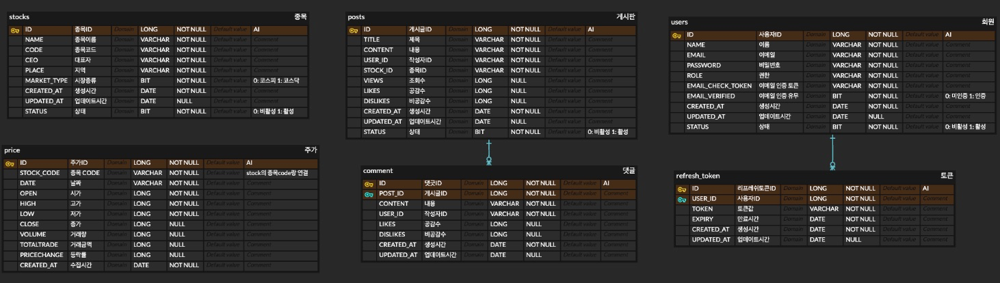

# 종목 토론 서비스

## 🚀 프로젝트 소개
종목 토론 서비스는 금융 시장에 대한 심도 있는 토론과 정보 공유를 가능하게 하는 소셜 미디어 플랫폼입니다.
이 서비스는 투자자들이 실시간 시장 동향을 학습하고, 자신의 투자 의견을 공유하며, 다른 사용자와 지식을 교환할 수 있는 공간을 제공합니다. 
사용자 중심의 디자인과 실시간 정보 제공을 통해, 투자 결정 과정에 필요한 모든 리소스를 한 곳에서 제공합니다.

## ✨ 프로젝트 핵심 기능 및 하이라이트

### 사용자 경험 중심의 디자인
- **사용자 관리 기능:** 회원가입, 로그인, 로그아웃, 프로필 관리 기능을 포함합니다.

### 커뮤니티 구축 및 네트워킹
- **팔로우 및 네트워킹:** 관심 있는 사용자를 팔로우하고 금융 지식을 공유할 수 있는 활발한 커뮤니티입니다.
- **포스트 및 뉴스피드:**  다양한 시각에서의 최신 시장 정보와 투자 의견을 자유롭게 표현하고 탐색할 수 있습니다.
- **댓글 및 상호 작용:** 사용자 간 의견 교환을 촉진하는 댓글과 좋아요 기능으로 풍부한 토론 환경을 조성합니다.

### 실시간 정보와 분석
- **시장 데이터 및 분석 도구:** 사용자들이 실시간으로 시장 동향을 파악하고, 깊이 있는 분석을 통해 정보에 기반한 의사결정을 내릴 수 있도록 지원합니다.

### 보안과 신뢰
- **고급 보안 프로토콜:** 사용자 데이터와 소통을 안전하게 보호하기 위해 최신 보안 기술을 적용합니다.

## 🔧 기술 스택
- **프로그래밍 언어:** Java 17
- **프레임워크:** Spring Boot 3
- **빌드 툴:** Gradle
- **데이터베이스:** MySQL
- **인증:** JWT
- **기타:** Docker, Docker Compose

## 🌟 시작하기

### 전제 조건
- JDK 17 이상 설치
- Docker 및 Docker Compose 설치

### 설치 방법
```bash
# 소스 코드 클론하기
git clone https://github.com/choihyunjun123/stock-talk

# Docker Compose를 사용하여 필요한 서비스 실행하기
cd [프로젝트 디렉토리]
docker-compose up -d

# 애플리케이션 빌드 및 실행
./gradlew build clean
./gradlew bootRun
```

### 데이터베이스 접속
- **URL:** localhost:8084
- **Database:** mydatabase
- **ID:** user
- **Password:** password

## 📊 ERD 설계

상세한 데이터 모델 설계는 [ErdCloud](https://www.erdcloud.com/d/QT354Ekvet9Zd5sAr)에서 확인할 수 있습니다.

## API 문서
자세한 API 문서는 [여기](https://jjunys.notion.site/API-c6d0ae7b9c494660af1fa303432d9627?pvs=4)에서 확인할 수 있습니다.

## File 구조
```
stock-talk/
├── stock-service/               # 주식 정보 서비스
│   └── stock/
├── price-data-service/          # 가격 데이터 서비스
│   └── price/
├── discussion-board-service/    # 커뮤니티 서비스
│   └── discussion/
│       └── post/
└── authentication-service/      # 인증 서비스
    └── user/
```

## 기술적 문제 해결 방법 및 사용 이유

### 회원가입 및 로그인 보안 강화

- 회원가입 및 로그인 과정의 보안을 강화하기 위해 JSON Web Token(JWT) 적용했습니다.
이는 사용자 정보 보호를 우선시하며, 시스템의 확장성을 높이고 서버 자원 사용량을 줄이기 위한 결정입니다.

상세한 구현 방법과 기술적 세부사항은 [블로그 포스트](https://blog.naver.com/sajun28/223383250964)에서 확인할 수 있습니다.

### MSA 적용 및 데이터베이스 분할 전략

- 시스템의 안정성을 확보하고 데이터 처리 성능을 개선하기 위해 마이크로서비스 아키텍처(MSA)와 데이터베이스 분할 전략을 채택했습니다. 
이는 데이터 집약적 작업의 효율성을 높이고, 시스템의 유지보수성 및 확장성을 향상시키기 위한 조치입니다.

상세한 구현 방법과 기술적 세부사항은 [블로그 포스트](블로그_포스트_URL)에서 확인할 수 있습니다.

### Spring Batch를 통한 대용량 데이터 처리 최적화

- 기존 데이터 처리 시스템에서는 중간에 오류가 발생할 경우, 전체 작업을 처음부터 다시 시작해야 했습니다. 
이로 인해 시간이 낭비되고, 전체 작업의 신뢰성이 저하되었습니다. Spring Batch를 도입하여 대용량 데이터 처리 과정의 신뢰성과 효율성을 향상시켰습니다.

상세한 구현 방법과 기술적 세부사항은 [블로그 포스트](블로그_포스트_URL)에서 확인할 수 있습니다.
